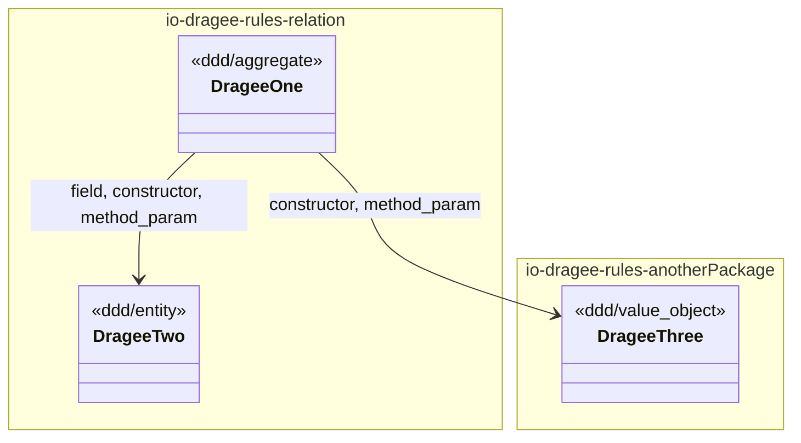
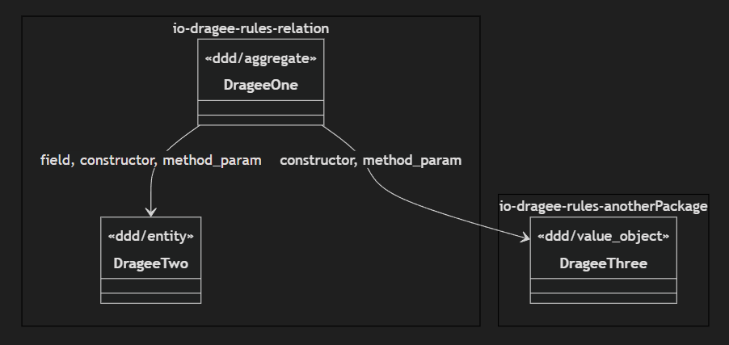

# Class Diagram

**class-diagram**

Markdown Class Diagram with [mermaidjs](https://github.com/mermaid-js/mermaid)

## Example





## Variables

### default

```ts
default: object;
```

#### Type declaration

##### handler()

```ts
handler: (dragees) => string = drawHandlerClassDiagram;
```

###### Parameters

###### dragees

`Dragee`[]

###### Returns

`string`

##### label

```ts
label: string = 'Class Diagram';
```

#### Defined in

[ddd-class-diagram.graph.ts:80](https://github.com/dragee-io/ddd-grapher/blob/7d0fe2f0669eeaffc6085d5308b5958f76f7afef/src/graphs/ddd-class-diagram.graph.ts#L80)
